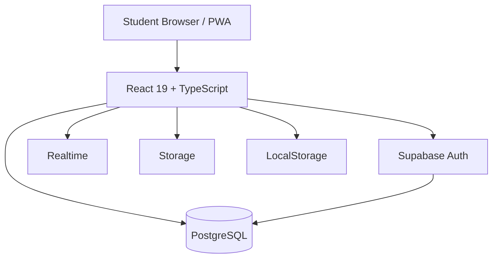

# 🌐 Polytech Portal (PP)

> **A Student-Centric Academic Operating System for ESP – DGI**

**Polytech Portal (PP)** is a Progressive Web Application designed as a **personal academic operating system** for students of the **École Supérieure Polytechnique (ESP)**, specifically within the **Département Génie Informatique (DGI)**.

PP merges three traditionally disconnected layers into a single coherent system:

1. **Browser Start Page** — instant access & cognitive offloading  
2. **Academic Dashboard** — schedule, subjects, tasks, notes  
3. **Institutional Communication Layer** — structured announcements  

The result is a **Single Source of Truth** that adapts to real academic constraints rather than generic productivity assumptions.

🔗 **Live Deployment:** https://pp.bluedish.tech

---

## 🎯 Core Vision

PPP was born from a simple observation:

> *ESP students juggle institutional rigidity and personal chaos using tools that were never designed for academic reality.*

### Design Principles

- **Academic Priority First**
  - Timetables override tasks
  - Subjects override habits
  - Deadlines reshape schedules dynamically

- **Zero-Friction Access**
  - The Home Page replaces the browser’s New Tab
  - No bookmarks, no hunting, no context switching

- **Progressive Disclosure**
  - What you need *now* is visible
  - What you’ll need *later* fades into the background

- **Institutional Identity**
  - ESP culture is structural, not decorative

- **Cloud-Synced Persistence**
  - Notes, profile metadata, and configurations are stored in Supabase, not just locally.

---

## 🏠 Home Page — Intelligence Start Page

A domain-aware browser start page optimized for academic workflows.

### Features
- Central search bar
- Custom branding (logo, title, background)
- Quick-access academic platforms:
  - Huawei Talent
  - OpenClassrooms
  - CS50
  - Google Classroom
  - Google Drive (DUT 1 TR)
  - Curated YouTube educators

### 🧠 App Intelligence Groups

Floating, non-blocking, Chrome-like app drawers.

| Position | Purpose |
|--------|--------|
| Top Left | Communication & Meetings |
| Top Right | Knowledge & Exploration |
| Bottom Left | Operating Systems |
| Bottom Right | Advanced Tech Stacks |

Each group is:
- Editable
- Disable-able
- Persisted locally (v1)

---

## 📊 Dashboard — Academic Command Center

Accessible via a contextual toggle from the Home Page.

### Navigation
- Collapsible sidebar
- Icon-only compact mode
- Persistent academic context

---

## 📅 Schedule System (Core Engine)

### Dual View Model
- **Timetable** — institutional, fixed, highest priority
- **Daily Schedule** — adaptive, task-driven
- **Exams** — dedicated view for academic assessments (Admin-controlled)

### Hard Priority Rules
1. Timetable subjects  
2. Subject-linked tasks  
3. Personal tasks  
4. Recurring habits  

Example:  
If *Algorithmique TD (13:00–15:00)* exists, a recurring prayer at 14:15 is **automatically shifted**.

### Progressive Urgency
- Deadlines transition from neutral → orange → red
- Completed tasks disappear from active views

---

## 🎯 Focus Lab

An embedded productivity sandbox.

### Modules
- Pomodoro
- Stopwatch
- Timer
- Alarms
- World Clock (Dakar Time)

All modules share a unified timing engine to prevent conflicts.

---

## 📚 Subjects System

Subjects act as **academic containers**.

### Subject Overview
- Subject banner
- Notes
- Tasks
- Schedule occurrences

### Design System
- `rounded-3xl`
- `hover:-translate-y-1`
- `hover:shadow-xl`
- Image-based headers
- Metadata footer (code, CM / TD / TP)

### Internal Tabs
- CM (read-only)
- TD
- TP
- Notes
- Tasks

---

## 📝 Notes Engine

- Full CRUD
- Cloud Persistence: Synchronized with Supabase for cross-device access
- Rich text formatting:
  - Headings
  - Bold / Italic / Underline
  - Code blocks
  - Lists
  - Links

### Organization
- Time-based grouping
- Subject filtering
- Tag filtering
- Pinned notes

Notes created inside a subject are automatically tagged and visible globally.

---

## 📢 Announcements

> This is **not a forum**.

### Rules
- Admin-only publishing
- Students can:
  - Read
  - Convert announcements into tasks

### Purpose
- Replace fragmented WhatsApp broadcasts
- Preserve academic traceability

---

## 👤 Profile Page

Used for both first-time setup and ongoing configuration.

### Features
- Full name
- Classroom (default: DUT 1 TR)
- Avatar (Base64 storage in Supabase)
- Role visibility (User / Admin)
- Cloud persistence (v2)
- Logout

---

## 🛠️ Admin Panel — Central Command

A specialized interface for platform administrators.

### Features
- **Toggle System**: Granular control over dashboard pages (Show/Hide).
- **Access Control**: Enable/Disable the "Dashboard" button on the Home page.
- **Signup Lock**: Toggle the visibility of the signup link to control user registration.
- **Exam Management**: Dedicated settings for configuring exam schedules.
- **Announcement Publishing**: Broadcast structured notices to all students.

## 🛠️ Technical Architecture

### Frontend
- React 19
- TypeScript (strict)
- Tailwind CSS
- Material Symbols
- Glassmorphism UI

### Backend
- Supabase Auth
- PostgreSQL
- Row Level Security (RLS)
- Realtime (Announcements)

### PWA
- Offline-ready
- Installable
- Fast cold start

---

## 🧩 High-Level Architecture



---

## 📂 Project Structure

```text
src/
├── App.tsx
├── Auth.tsx
├── Dashboard.tsx
├── Home.tsx
├── supabase.ts
├── types.ts
├── constants.tsx
│
├── Dashboard/
│   ├── Overview.tsx
│   ├── Schedule.tsx
│   ├── Timetable.tsx
│   ├── Subjects.tsx
│   ├── SubjectDetail.tsx
│   ├── Notes.tsx
│   ├── FocusLab.tsx
│   ├── Annonces.tsx
│   ├── AdminPanel.tsx
│   └── ProfilePage.tsx
│
public/
└── materials/
    └── SUBJECT/
        ├── CM/
        ├── TD/
        └── TP/
```

---

## 👨‍💻 Installation & Setup

### Prerequisites

- Node.js v18+
- npm or yarn
- Supabase project

### Steps

1. **Clone Repository**
   ```bash
   git clone https://github.com/your-username/pseudo-polytech-portal.git
   cd pseudo-polytech-portal
   ```

2. **Install Dependencies**
   ```bash
   npm install
   ```

3. **Environment Variables**
   Create `.env.local`:
   ```env
   VITE_SUPABASE_URL=your_supabase_project_url
   VITE_SUPABASE_ANON_KEY=your_supabase_anon_key
   ```

4. **Database Setup**
   Run the SQL scripts provided in the `db_setup_v11.sql` file using the Supabase SQL Editor.

5. **Run Development Server**
   ```bash
   npm run build
   npm run dev
   ```

---

## 🧠 Status & Roadmap

PPP is intentionally iterative.
v5 focuses on:

- UX correctness
- Academic logic
- Local persistence
- Backend expansion follows once workflows stabilize.

---

## 👤 Authorship & Ownership

- **Author:** Samba Sene
- **Designation:** First-Year Student — Networking & Telecommunications (DUT 1 TR)
- **Institution:** École Supérieure Polytechnique (ESP)
- **Project Status:** Independent student project

### Disclaimer
Polytech Portal (PP) is not an official ESP or DGI product. It is not endorsed, maintained, or supported by École Supérieure Polytechnique or its departments.

**PP is an independent academic tool — built by students, for students.**
